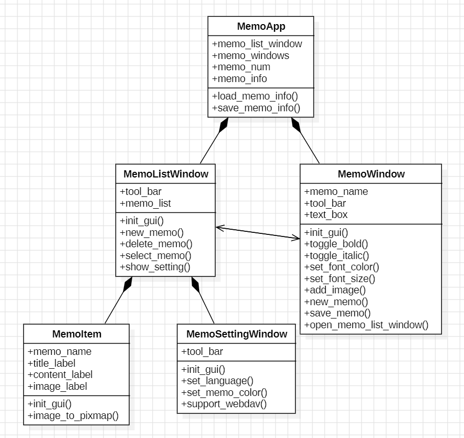

# 设计实现：便签

2020K8009929017 侯昱帆

本项目旨在基于面向对象的思想，设计一款能随手记录零碎信息的**便签应用**。本项目使用 Python 语言，并用 PyQt5 开发图形界面。

## 一、从功能分析与建模

### 1. 功能描述

便签程序主要分为三种窗口：便签列表窗口、便签窗口和设置窗口，其主要功能如下：

**便签列表窗口**

- [ ] 新建便签
- [ ] 删除便签
- [ ] 选择便签后加载相应便签窗口

**便签窗口**

- [ ] 基本文字排版
- [ ] 插入图片
- [ ] 新建便签
- [ ] 查看便签列表窗口

**设置窗口**

- [ ] 语言设置
- [ ] 便签颜色设置
- [ ] 云存储接入

### 2. 需求分析

程序开始运行后，将显示**便签列表窗口**。在便签列表窗口中，双击列表项，程序会显示相应的**便签窗口**；单击设置按钮，程序会显示**设置窗口**。在三种窗口中，用户可以进行不同的操作。具体说明如下：

**便签列表窗口 MemoListWindow**

- 新建便签：用户点击新建按钮，程序在便签列表中创建新的列表项，并新建一个便签窗口
- 删除便签：用户单击一个列表项，再点击删除按钮，程序会删除该列表项
- 选择便签后加载相应便签窗口：用户双击一个列表项，程序会打开相应的便签窗口

**便签窗口 MemoWindow**

- 基本文字排版：用户选中一段文字，点击文字排版按钮，文字会变为相应的格式，本程序支持粗体、斜体、颜色、字号等格式
- 插入图片：用户点击插入图片按钮，并在对话框选中图片，便签中会插入相应的图片
- 新建便签：用户点击新建按钮，程序会新建一个便签窗口
- 查看便签列表窗口：用户点击查看便签列表按钮，程序会显示便签列表

**设置窗口 MemoSettingWindow**

- 语言设置：用户选定语言，便签程序会用相应的语言显示
- 便签颜色设置：用户选定颜色，便签会变为相应颜色
- 云存储接入：让便签能够上传到坚果云（大概...）

### 3. 建模

根据上述分析，可以创建三种类，分别是 **MemoListWindow，MemoWindow 和 MemoSettingWindow**。

便签程序通常会涉及到多个窗口的交互，比如从便签列表窗口可以创建多个便签窗口，反过来，从便签窗口也可以创建便签列表窗口。除此之外，便签文件的信息，比如便签名、便签标题、图片路径等也需要存储。故创建 **MemoApp** 类，用于管理窗口和便签信息。

为了方便用户使用，便签列表的列表项会反映便签信息，比如便签标题、内容、图片等，所以列表项也需要一定的布局设计。故创建 **MemoItem** 类，作为列表项。

| 对象              | 属性                                                | 操作                                                         |
| :---------------- | :-------------------------------------------------- | :----------------------------------------------------------- |
| MemoApp           | memo_list_window, memo_windows, memo_num, memo_info | load_memo_info,                                              |
| MemoListWindow    | tool_bar, memo_list                                 | init_gui, new_memo, delete_memo, select_memo, show_setting   |
| MemoItem          | memo_name, title_label, content_label, image_label  | init_gui, image_to_pixmap                                    |
| MemoWindow        | memo_name, tool_bar, text_box                       | init_gui, toggle_bold, toggle_italic, set_font_color, set_font_size, add_image, new_memo, save_memo, open_memo_list_window |
| MemoSettingWindow | tool_bar                                            | init_gui, set_language, set_memo_color, support_webdav       |

