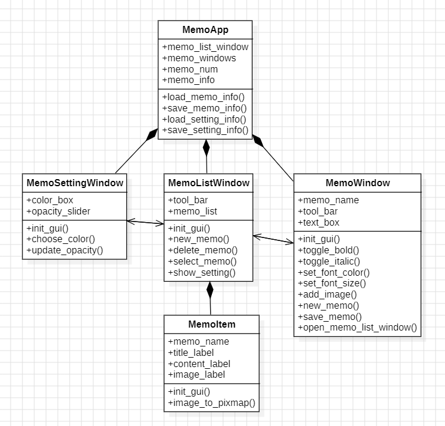
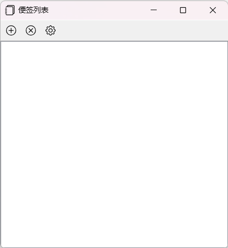
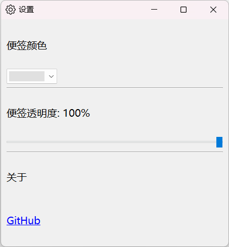
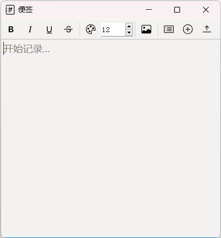
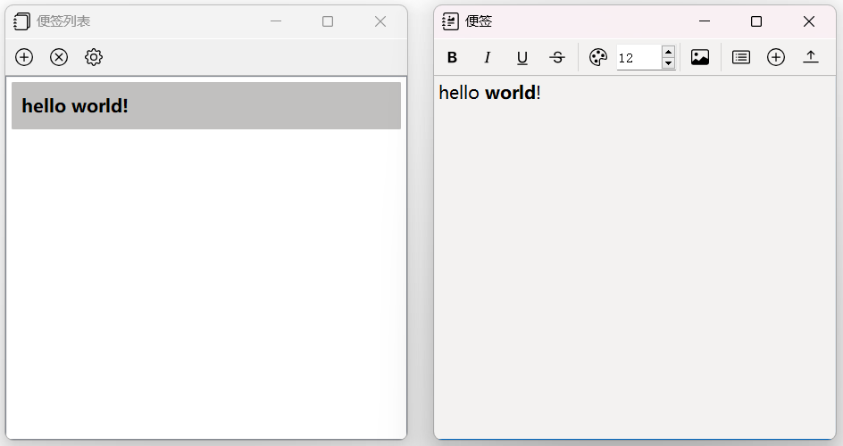
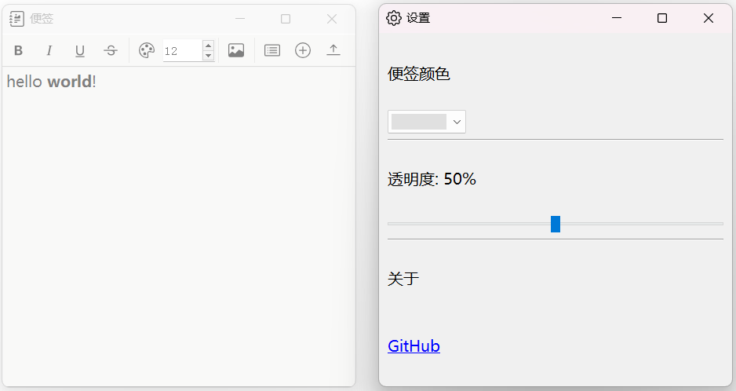
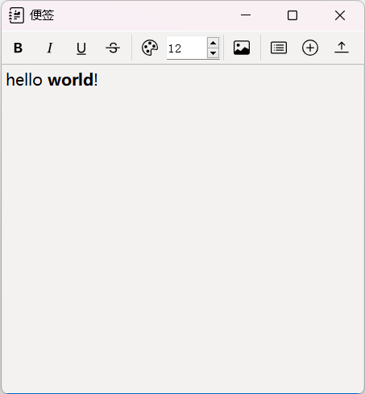
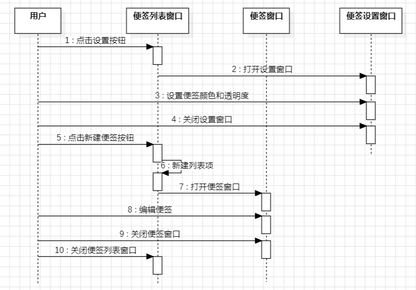
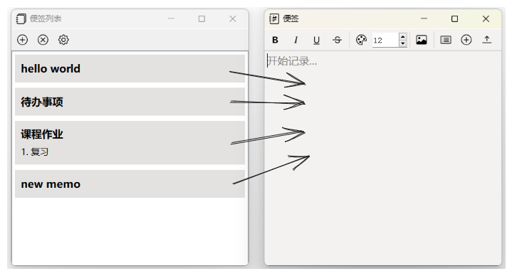

# 设计实现：便签

2020K8009929017 侯昱帆

本项目旨在基于面向对象的思想，设计一款能随手记录零碎信息的**便签应用**。本项目使用 Python 语言，并用 PyQt5 开发图形界面。

## 一、从功能分析与建模

### 1. 功能描述

便签程序主要分为三种窗口：便签列表窗口、便签窗口和设置窗口，其主要功能如下：

**便签列表窗口**

- [ ] 新建便签
- [ ] 删除便签
- [ ] 选择便签后加载相应便签窗口

**便签窗口**

- [ ] 基本文字排版
- [ ] 插入图片
- [ ] 新建便签
- [ ] 查看便签列表窗口

**设置窗口**

- [ ] 便签颜色设置
- [ ] 便签透明度设置

### 2. 需求分析

程序开始运行后，将显示**便签列表窗口**。在便签列表窗口中，双击列表项，程序会显示相应的**便签窗口**；单击设置按钮，程序会显示**设置窗口**。在三种窗口中，用户可以进行不同的操作。具体说明如下：

**便签列表窗口 MemoListWindow**

- 新建便签：用户点击新建按钮，程序在便签列表中创建新的列表项，并新建一个便签窗口
- 删除便签：用户单击一个列表项，再点击删除按钮，程序会删除该列表项
- 选择便签后加载相应便签窗口：用户双击一个列表项，程序会打开相应的便签窗口

**便签窗口 MemoWindow**

- 基本文字排版：用户选中一段文字，点击文字排版按钮，文字会变为相应的格式，本程序支持粗体、斜体、颜色、字号等格式
- 插入图片：用户点击插入图片按钮，并在对话框选中图片，便签中会插入相应的图片
- 新建便签：用户点击新建按钮，程序会新建一个便签窗口
- 查看便签列表窗口：用户点击查看便签列表按钮，程序会显示便签列表

**设置窗口 MemoSettingWindow**

- 便签颜色设置：用户选定颜色，便签会变为相应颜色
- 便签透明度设置：用户选定透明度，便签以相应透明度显示

### 3. 建模

根据上述分析，可以创建三种类，分别是 **MemoListWindow，MemoWindow 和 MemoSettingWindow**。

便签程序通常会涉及到多个窗口的交互，比如从便签列表窗口可以创建多个便签窗口，反过来，从便签窗口也可以创建便签列表窗口。除此之外，便签文件的信息，比如便签名、便签标题、图片路径等也需要存储。故创建 **MemoApp** 类，用于管理窗口和便签信息。

为了方便用户使用，便签列表的列表项会反映便签信息，比如便签标题、内容、图片等，所以列表项也需要一定的布局设计。故创建 **MemoItem** 类，作为列表项。

| 对象              | 属性                                                | 操作                                                         |
| :---------------- | :-------------------------------------------------- | :----------------------------------------------------------- |
| MemoApp           | memo_list_window, memo_windows, memo_num, memo_info | load_memo_info, save_memo_info, load_setting_info, save_setting_info |
| MemoListWindow    | tool_bar, memo_list                                 | init_gui, new_memo, delete_memo, select_memo, show_setting   |
| MemoItem          | memo_name, title_label, content_label, image_label  | init_gui, image_to_pixmap                                    |
| MemoWindow        | memo_name, tool_bar, text_box                       | init_gui, toggle_bold, toggle_italic, set_font_color, set_font_size, add_image, new_memo, save_memo, open_memo_list_window |
| MemoSettingWindow | color_box, opacity_slider                           | init_gui, choose_color, update_opacity                       |



## 二、核心流程设计分析

### 1. 用户界面

便签软件首先需要一个交互界面。PyQt5 提供了 `QMainWindow` 类，用来设计窗口。利用 `QMainWindow` 类，可以实现便签列表窗口、便签设置窗口和便签窗口。部分代码如下：

#### 便签列表窗口

```python
class MemoListWindow(QMainWindow):
    """
    便签列表窗口

    显示便签列表, 新建、删除便签, 打开便签设置页面
    """

    def __init__(self, memo_app):
        super().__init__()

        # 便签程序
        self.memo_app = memo_app

        # 被选中的便签名字
        self.selected_memo = ""

        # 窗口布局
        self.init_gui()

    def init_gui(self):
        """窗口布局"""
        # 窗口名
        self.setWindowTitle("便签列表")

        # 窗口图标
        self.setWindowIcon(QIcon("icon/journals.png"))

        # 窗口大小
        self.resize(450, 450)

        # 工具栏和便签列表
        self.set_tool_bar()
        self.set_memo_list()
        self.addToolBar(self.tool_bar)
        self.setCentralWidget(self.memo_list)

        # 显示窗口
        self.show()
```



#### 便签设置窗口

```python
class MemoSettingWindow(QMainWindow):
    """
    便签设置窗口

    设置便签颜色、透明度, 存放GitHub链接
    """

    def __init__(self, memo_app, pos_x, pos_y):
        super().__init__()

        # 便签程序
        self.memo_app = memo_app

        # 窗口布局
        self.init_gui(pos_x, pos_y)

    def init_gui(self, pos_x, pos_y):
        """设置页面布局"""
        # 窗口名
        self.setWindowTitle("设置")

        # 窗口图标
        self.setWindowIcon(QIcon("icon/gear.png"))

        # 窗口位置和大小
        self.setGeometry(pos_x, pos_y, 450, 450)

        # 窗口字体设置
        font = QFont("微软雅黑", 12)
        self.setFont(font)

        # 窗口布局
        self.setting_layout = QVBoxLayout()

        # 便签颜色设置
        self.color_lable = QLabel("便签颜色")

        self.color_box = QComboBox(self)

        color_dic = {"pink": (255, 175, 223),
                     "yellow": (255, 230, 110),
                     "blue": (158, 223, 255),
                     "green": (161, 239, 155),
                     "purple": (215, 175, 255),
                     "grey": (224, 224, 224)
                     }

        for color in color_dic.values():
            pixColor = QPixmap(70, 20)
            pixColor.fill(QColor(color[0], color[1], color[2]))
            self.color_box.addItem(QIcon(pixColor), '')
            self.color_box.setIconSize(QSize(70, 20))

        self.color_box.setFixedSize(100, 30)
        self.color_box.currentIndexChanged.connect(self.choose_color)
        self.color_box.setCurrentIndex(
            self.memo_app.setting_info["background"]["index"])

        self.setting_layout.addWidget(self.color_lable)
        self.setting_layout.addWidget(self.color_box)

        # 分割线
        line = QFrame(self)
        line.setFrameShape(QFrame.HLine)
        line.setFrameShadow(QFrame.Sunken)
        self.setting_layout.addWidget(line)

        # 便签透明度设置
        self.opacity_label = QLabel("便签透明度")
        opacity_value = int(self.memo_app.setting_info["opacity"]*100)
        self.opacity_label.setText(f'便签透明度: {opacity_value}%')

        self.opacity_slider = QSlider(Qt.Horizontal)
        self.opacity_slider.setRange(0, 100)
        self.opacity_slider.setValue(opacity_value)
        self.opacity_slider.valueChanged.connect(self.update_opacity)

        self.setting_layout.addWidget(self.opacity_label)
        self.setting_layout.addWidget(self.opacity_slider)

        # 分割线
        line = QFrame(self)
        line.setFrameShape(QFrame.HLine)
        line.setFrameShadow(QFrame.Sunken)
        self.setting_layout.addWidget(line)

        # 关于
        self.about_lable = QLabel("关于")

        self.url_lable = QLabel(
            '<a href="https://github.com/Sisyphus0218/UCAS-OOP/tree/master/my_memo">GitHub</a>')
        self.url_lable.setOpenExternalLinks(True)

        self.setting_layout.addWidget(self.about_lable)
        self.setting_layout.addWidget(self.url_lable)

        self.central_widget = QWidget(self)
        self.central_widget.setLayout(self.setting_layout)
        self.setCentralWidget(self.central_widget)

        # 显示窗口
        self.show()
```



#### 便签窗口

```python
class MemoWindow(QMainWindow):
    """
    便签窗口

    文字排版、插入图片、新建便签、打开便签列表
    """

    def __init__(self, memo_name, memo_app, pos_x, pos_y):
        super().__init__()

        # 便签程序
        self.memo_app = memo_app

        # 便签名字
        self.memo_name = memo_name

        # 窗口布局
        self.init_gui(pos_x, pos_y)

    def init_gui(self, pos_x, pos_y):
        """窗口布局"""
        # 窗口名
        self.setWindowTitle("便签")

        # 窗口图标
        self.setWindowIcon(QIcon("icon/journal-richtext.png"))

        # 窗口位置和大小
        pos_x, pos_y
        self.setGeometry(pos_x, pos_y, 450, 450)

        # 窗口颜色
        color = self.memo_app.setting_info["background"]["rgb"]
        palette = QPalette()
        palette.setColor(QPalette.Window, QColor(color[0], color[1], color[2]))
        self.setPalette(palette)

        # 窗口透明度
        opacity_value = self.memo_app.setting_info["opacity"]
        self.setWindowOpacity(opacity_value)

        # 工具栏和文本框
        self.set_tool_bar()
        self.set_text_box()
        self.addToolBar(self.tool_bar)
        self.setCentralWidget(self.text_box)

        # 显示窗口
        self.show()
```



### 2. 事件响应

完成界面布局后，需要给按钮绑定事件，以达到交互的效果。

#### 便签列表窗口

便签列表窗口中主要涉及对便签列表的操作，如新增列表项、删除列表项、双击列表项打开便签窗口等。比如对于双击列表项打开便签窗口的操作，可以给双击操作绑定事件 `self.memo_list.itemDoubleClicked.connect(self.select_memo)`，这样当双击一个列表项时，就会调用 `self.select_memo` 来打开相应的便签窗口。其他操作也可以通过类似思路实现。

```python
class MemoListWindow(QMainWindow):
	......
	
    def set_memo_list(self):
        """便签列表布局"""
        # 便签列表
        self.memo_list = QListWidget()

        # 将便签加载到便签列表
        self.load_memo_list()

        # 双击列表项, 绑定选择便签事件
        self.memo_list.itemDoubleClicked.connect(self.select_memo)
    
    def select_memo(self, item):
        """选择便签"""
        # 获取选中的便签
        if isinstance(item, QListWidgetItem):
            memo_item = self.centralWidget().itemWidget(item)
            if isinstance(memo_item, MemoItem):
                self.selected_memo = memo_item.memo_name

        # 若便签已经被打开, 直接显示, 否则加载便签
        if self.selected_memo in self.memo_app.memo_windows:
            self.memo_app.memo_windows[self.selected_memo].showNormal()
        else:
            self.load_memo()
```



#### 便签设置窗口

便签设置窗口主要用于设置便签的颜色和透明度。比如对于透明度设置，可以先通过 `QSlider` 类设置一个滑块 `self.opacity_slider`，再给滑块绑定事件 `self.opacity_slider.valueChanged.connect(self.update_opacity)`，这样当调整滑块时，就会调用 `self.update_opacity` 来调整便签透明度。颜色设置也可以通过类似思路实现。

```python
class MemoSettingWindow(QMainWindow):
    ......

    def init_gui(self, pos_x, pos_y):
        """设置页面布局"""
        ......

        # 便签透明度设置
        self.opacity_label = QLabel("便签透明度")
        opacity_value = int(self.memo_app.setting_info["opacity"]*100)
        self.opacity_label.setText(f'便签透明度: {opacity_value}%')

        self.opacity_slider = QSlider(Qt.Horizontal)
        self.opacity_slider.setRange(0, 100)
        self.opacity_slider.setValue(opacity_value)
        self.opacity_slider.valueChanged.connect(self.update_opacity)

        self.setting_layout.addWidget(self.opacity_label)
        self.setting_layout.addWidget(self.opacity_slider)
        ......

    def update_opacity(self, value):
        """选择便签透明度"""
        opacity_value = value / 100.0
        self.opacity_label.setText(f'透明度: {value}%')
        self.memo_app.setting_info["opacity"] = opacity_value
        self.memo_app.save_setting_info()
```



#### 便签窗口

便签窗口中有一个工具栏，工具栏中有一系列更改文本格式的按钮。比如对于 `MemoWindow` 类中的粗体按钮，通过 `self.bold_action.triggered.connect(self.toggle_bold)` 绑定 `self.toggle_bold`，这样当用户选中一段文字后点击粗体按钮，就可以通过调用 `self.toggle_bold` 实现粗体效果。工具栏中的其他按钮效果也可以通过类似的思路实现。

```python
class MemoWindow(QMainWindow):
    ......
    
    def set_tool_bar(self):
        """工具栏布局"""
        # 工具栏
        self.tool_bar = QToolBar()
        self.tool_bar.setMovable(False)
        self.tool_bar.setIconSize(QSize(32, 32))  # 设置图标大小为32x32像素

        # 粗体
        self.bold_action = QAction(
            QIcon("icon/type-bold.png"), "粗体<br>Ctrl+B", self)
        self.bold_action.setShortcut("Ctrl+B")
        self.bold_action.triggered.connect(self.toggle_bold)  # 绑定事件
        self.tool_bar.addAction(self.bold_action)

        # 斜体
        ......
    
    def toggle_bold(self):
        """粗体"""
        cursor = self.text_box.textCursor()

        # 若没选中, 直接返回
        if not cursor.hasSelection():
            return

        # 所选范围
        start = cursor.selectionStart()
        end = cursor.selectionEnd()

        # 选中第一个字符, 判断是否为粗体
        cursor.setPosition(start)
        cursor.setPosition(start + 1, QTextCursor.KeepAnchor)
        char_format = cursor.charFormat()
        is_first_char_bold = char_format.font().bold()

        # 重新选中原来的文本, 若第一个字符为粗体, 就取消粗体, 反之加粗
        cursor.setPosition(start)
        cursor.setPosition(end, QTextCursor.KeepAnchor)
        char_format = cursor.charFormat()
        font = char_format.font()
        font.setBold(not is_first_char_bold)
        char_format.setFont(font)
        cursor.setCharFormat(char_format)
        self.text_box.setTextCursor(cursor)
```



### 3. 顺序图



## 三、高级设计意图分析

本次大作业的设计实现中，我主要采用了单例模式和观察者模式。

### 1. 单例模式

在便签程序中，用户最多只能打开 1 个便签列表窗口和 1 个便签设置窗口，因此需要保证 `MemoListWindow` 和 `MemoSettingWindow` 类都仅有一个实例。python 中有多种实现单例模式的方法，我使用了装饰器来实现单例模式：编写一个单例模式的装饰器，来装饰那些需要支持单例的类。函数 `singleton` 接收一个类（`cls`）以及任意数量的参数和关键字参数，并返回一个闭包函数 `wrapper`。这个闭包函数负责确保该类的实例仅被创建一次。

```python
def singleton(cls):
    instances = {}

    def wrapper(*args, **kw):
        if cls not in instances:
            instances[cls] = cls(*args, **kw)
        return instances[cls]

    return wrapper


@singleton
class MemoListWindow(QMainWindow):
    """
    便签列表窗口

    显示便签列表, 新建、删除便签, 打开便签设置页面
    """

    def __init__(self, memo_app):
        super().__init__()
        ......
```

### 2. 观察者模式

在便签程序中，便签列表窗口包含一些列表项，这些列表项作为观察者。因为有时不方便将便签窗口与便签列表项一一对应，当对便签窗口进行一些操作时，便签列表窗口会通知所有的列表项，由列表项来判断便签窗口是否与自己对应，然后进行相应的操作。



## 总结

通过面向对象程序设计课的学习，我认识到了在现实的程序设计中，编写一定规模的、可重用性和可扩充性俱佳的程序的重要性。通过自己编写代码完成设计实现，我对面向对象思想也有了更加深刻的认识。由于经验不足，这次设计实现仍然存在很多缺陷。写到后期，当代码量变多时，我也感受到自己类的设计还存在一定的问题，应该还可以进一步的封装。但这也为今后打下铺垫，以后编写代码时，我会更加注重抽象、隐藏、封装、模块化的编程思想。本设计实现的代码已放在 git仓库中 。
